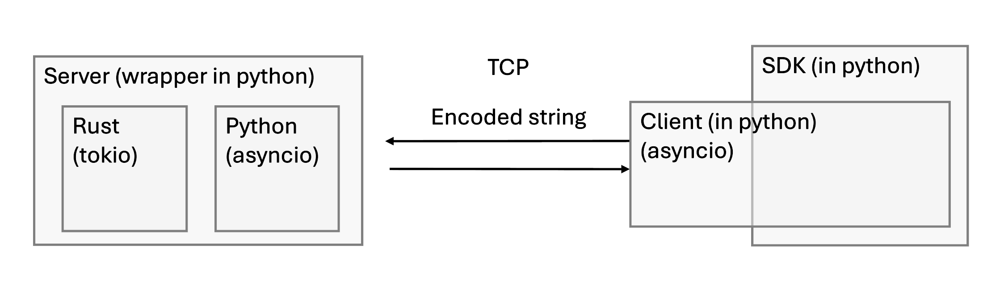

# How to make an agent with the SDK

## Quickstart


## Run server and clients

<p align="center">

</p>

In terminal 1:
```
python user_space/myserver.py --option <rust_of_python>
```
The tag `<rust_of_python>` can take either of the following values:
  - `python`: to use a python implementation of the server based on `asyncio`;
  - `rust_v1`: to use a preliminary rust implementation of the server based on `tokio`;
  - `rust_v2`: to use a improved rust implementation of the server based on `tokio`;
  - `rust_v2_1`: to use a better rust implementation of the server based on `tokio`;
  - `rust_v2_2`: to use a better rust implementation of the server based on `tokio`;
  - `rust_v2_3`: to use a better rust implementation of the server based on `tokio`;

In terminal 2:
```
python user_space/myclient.py
```

In terminal 3:
```
python user_space/myclient.py
```

Try to talk or shutdown the server / clients (clean shutdown integrated).