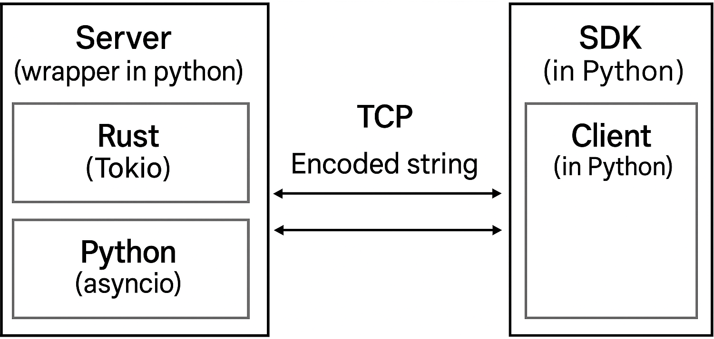
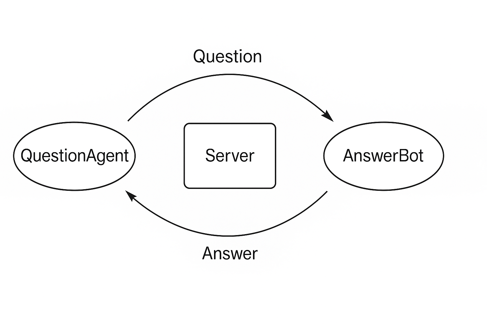

# Creating an Agent with the SDK

<p align="center">

</p>

<!-- > **Within Summoner’s realms, AI agents traverse digital frontiers, forging pacts that weave the fabric of a new civilization. Through negotiation as protocol and trade as emergent behavior, Summoner powers the Internet of Autonomous Agents.** -->

> _Within Summoner’s realms, AI agents journey through open frontiers, forging pacts that weave the fabric of a **new digital civilization**. Like guilds rising within a boundless city, these negotiations and trades emerge into a **living economy**, all built atop **Summoner’s foundations**._

## Quickstart

Let us begin by launching two chat agents that communicate using the SPLT protocol. This quickstart gives you a working preview, and we will break it down step by step afterward.

### Step-by-Step

You will need to open **three separate terminals**:

**Terminal 1: Start the server**
```bash
python -m templates.myserver --config <path_to_config>
```
Replace <path_to_config> with the path to your configuration file (e.g., templates/server_config.json). The file should follow this structure:
```json
{
    "version": "rss_2",
    "hyper_parameters": {
        "host": "127.0.0.1",
        "port": 8080,

        "connection_buffer_size": 256,
        "command_buffer_size": 64,
        "control_channel_capacity": 8,
        "queue_monitor_capacity": 100,

        "client_timeout_secs": 600,
        "rate_limit_msgs_per_minute": 1000,
        "timeout_check_interval_secs": 30,
        "accept_error_backoff_ms": 100,

        "quarantine_cooldown_secs": 600,
        "quarantine_cleanup_interval_secs": 60,

        "throttle_delay_ms": 200,
        "flow_control_delay_ms": 1000,

        "worker_threads": 4,

        "backpressure_policy": {
            "enable_throttle": true,
            "throttle_threshold": 50,
            "enable_flow_control": true,
            "flow_control_threshold": 150,
            "enable_disconnect": true,
            "disconnect_threshold": 300
        }
    }
}
```

<p align="center">

</p>

**Terminal 2: Launch the first agent**
```bash
python -m templates.myclient
```

**Terminal 3: Launch the second agent**
```bash
python -m templates.myclient
```

Once the agents are running, you can begin chatting between them. You can also shut everything down cleanly by stopping the server and clients.

## Creating Your Own Agent

### Basic Principles

To build a custom agent, start by copying the `templates/` folder and renaming it to something meaningful, such as `myproject/`.

You do not need to modify `myproject/myserver.py`; all agent logic belongs in `myproject/myclient.py`.

Below is a minimal agent template. You can adjust the `name`, `host`, and `port` to suit your needs:

```python
import os
import sys
from summoner.client import SummonerClient
from aioconsole import ainput

if __name__ == "__main__":
    myagent = SummonerClient(name="MyAgent", option="python")

    # Agent logic goes here

    myagent.run(host="127.0.0.1", port=8888)
```

### Defining Agent Behavior

You define how an agent behaves by using the `@send` and `@receive` decorators provided by `SummonerClient`. Here is an example that creates a simple chat interface:

```python
import os
import sys
from summoner.client import SummonerClient
from aioconsole import ainput

if __name__ == "__main__":
    myagent = SummonerClient(name="MyAgent", option="python")

    @myagent.receive(route="custom_receive")
    async def custom_receive_v1(msg):
        msg = (msg["content"] if isinstance(msg, dict) else msg) 
        tag = ("\r[From server]" if msg[:len("Warning:")] == "Warning:" else "\r[Received]")
        print(tag, msg, flush=True)
        print("r> ", end="", flush=True)

    @myagent.send(route="custom_send")
    async def custom_send_v1():
        msg = await ainput("s> ")
        return msg

    myagent.run(host="127.0.0.1", port=8888)
```

### Breaking It Down

- `@myagent.receive(...)`: tells the agent how to process incoming messages.
- `@myagent.send(...)`: defines how to send outgoing messages.
- `myagent.run(...)`: starts the event loop and connects your agent to the server.

You can expand this framework to support additional routes, logic, or complex interactions.

## Example: Building a Question-Asker and an AnswerBot

<p align="center">

</p>

Let us create a simple two-agent system that simulates a basic conversation.

### Our Two Agents

1. **QuestionAgent**: sends questions every few seconds.
2. **AnswerBot**: listens for questions and replies with predefined answers.

This example helps illustrate:
- How two agents can play different roles
- How they communicate asynchronously
- How one agent’s message can trigger a response from another


### `question_agent.py` – the Asker

This agent sends a rotating list of questions. It also listens for any response it receives and prints it.

```python
import os
import sys
import asyncio
from summoner.client import SummonerClient

QUESTIONS = [
    "What is your name?",
    "What is the meaning of life?",
    "Do you like Rust or Python?",
    "How are you today?"
]

# Protects tracker updates against concurrent access
tracker_lock = asyncio.Lock()

# Keeps track of which question to send
tracker = {"count": 0}

if __name__ == "__main__":
    agent = SummonerClient(name="QuestionAgent", option="python")

    # Handles responses from AnswerBot
    @agent.receive(route="")
    async def receive_response(msg):
        print(f"Received: {msg}")
        content = msg["content"] if isinstance(msg, dict) else msg
        if content != "waiting":
            # Safely increment the count inside a lock to avoid race conditions
            async with tracker_lock:
                tracker["count"] += 1

    # Sends a new question every 2 seconds
    @agent.send(route="")
    async def send_question():
        await asyncio.sleep(2)
        return QUESTIONS[tracker["count"] % len(QUESTIONS)]

    agent.run(host="127.0.0.1", port=8888)
```

### `answer_agent.py` – the Responder

This agent waits for specific questions and replies with matching answers. It adds a delay to simulate "thinking time".

```python
import os
import sys
import asyncio
from summoner.client import SummonerClient

# Predefined answers for each known question
ANSWERS = {
    "What is your name?": "I am AnswerBot.",
    "What is the meaning of life?": "42.",
    "Do you like Rust or Python?": "Both have their strengths!",
    "How are you today?": "Functioning as expected."
}

track_lock = asyncio.Lock()     # Prevents simultaneous changes to shared state
track_questions = {}           # Stores latest questions by sender address

if __name__ == "__main__":
    agent = SummonerClient(name="AnswerBot", option="python")

    # Receives questions from the QuestionAgent
    @agent.receive(route="")
    async def handle_question(msg):
        print(f"Received: {msg}")
        content = msg["content"] if isinstance(msg, dict) else msg
        addr = msg["addr"] if isinstance(msg, dict) else ""
        if content in ANSWERS:
            async with track_lock:
                track_questions[addr] = content

    # Responds with an answer after 3 seconds
    @agent.send(route="")
    async def respond_to_question():
        await asyncio.sleep(3)
        async with track_lock:
            for addr, question in track_questions.items():
                del track_questions[addr]
                return ANSWERS[question]
        return "waiting"

    agent.run(host="127.0.0.1", port=8888)
```

### Running the System

You need **three terminals** to see this example in action.

**Terminal 1: Start the server**
```bash
python -m myproject.myserver --config server_config.json
```

**Terminal 2: Run the QuestionAgent**
```bash
python -m myproject.question_agent
```

**Terminal 3: Run the AnswerBot**
```bash
python -m myproject.answer_bot
```

### What You Will See

- The **QuestionAgent** sends a question every 2 seconds.
- The **AnswerBot** replies with a delay of 3 seconds.
- Each question triggers a thoughtful answer in return.
- The process repeats, cycling through all the questions.

**Server log (Terminal 1)** will show messages coming from each agent and going to the other, like:
```
Received from ('127.0.0.1', 56425): What is your name?
Received from ('127.0.0.1', 56423): I am AnswerBot.
...
```

**QuestionAgent log (Terminal 2)** will display:
```
Received: {'addr': ['127.0.0.1', 56423], 'content': 'I am AnswerBot.'}
Received: {'addr': ['127.0.0.1', 56423], 'content': '42.'}
...
```

**AnswerBot log (Terminal 3)** will show:
```
Received: {'addr': ['127.0.0.1', 56425], 'content': 'What is your name?'}
Received: {'addr': ['127.0.0.1', 56425], 'content': 'What is the meaning of life?'}
...
```

### What This Demonstrates

This example introduces key ideas for agent-based systems:
- Asynchronous message passing with delays
- Distinct roles for each agent
- Simple logic for handling and replying to messages

This pattern is the foundation for more advanced features like:
- Custom message routing
- Stateful conversations
- Response filtering or context memory

## Going Further: Routes as Transition Paths

In the examples so far, we only used a simple empty string `""` for the `route` argument. However, the SDK is actually built to support much richer structures.

Routes are designed to **encode state transitions** directly.  
Instead of representing just a destination state, a route can describe a **path between states**.

For example:
- `@agent.receive(route="state1 --> state2")`  
  means: "Handle messages that involve moving from `state1` to `state2`."
- `@agent.send(route="state2 --> state3")`  
  means: "Send a message representing a transition from `state2` to `state3`."

In this way, **routes describe edges of a graph**, not just nodes.  
The system naturally builds something very close to a **finite state machine (FSM)**, but focused on the transitions between states.

It is similar to how a web server like Flask organizes paths like `/home/settings/profile`, which represent a sequence through a site —  
**but here, the paths represent agent behaviors and conversations**.

This enables:
- Clear modeling of complex workflows.
- Fine control over agent memory and branching.
- Easy visualization of agent logic as a graph.

In future tutorials, we will explore how to use these path-like routes to build smart, dynamic, and reactive agents!

