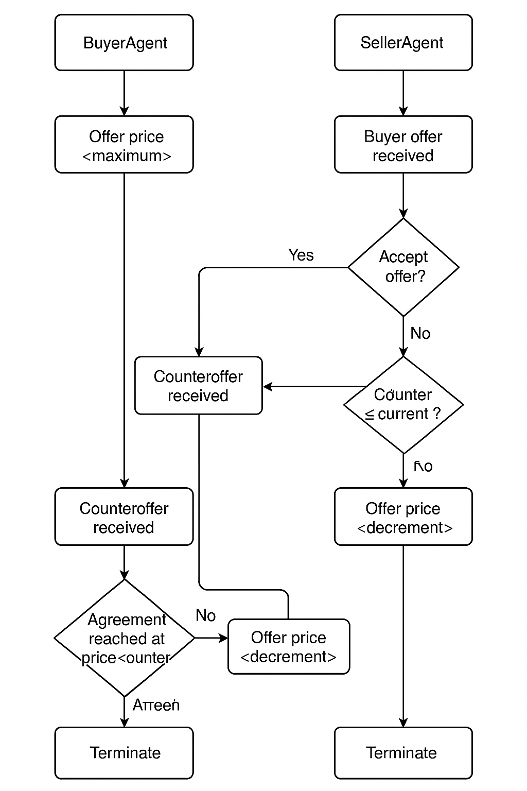
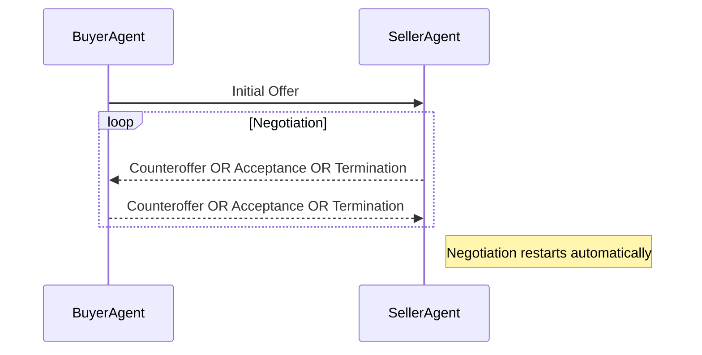

# Agent-Based Price Negotiation Protocol

<p align="center">

</p>


This README provides a detailed tutorial and walkthrough of an automated negotiation protocol between two autonomous agents: **SellerAgent** and **BuyerAgent**. The protocol illustrates asynchronous interactions, dynamic pricing strategies, randomized parameter adjustments, and continuous negotiation with real-time statistics.

## Overview

The agents engage in an automated price negotiation process, continuously proposing offers, evaluating responses, and adapting strategies dynamically. The goal is to reach a mutually acceptable price within randomly generated limits, making each negotiation unique and realistic.

### Features:
- **Dynamic pricing**: Prices and increments/decrements are randomly chosen each negotiation round.
- **Real-time statistics**: Tracks and displays negotiation success rates.
- **Continuous execution**: Automatically restarts negotiations upon completion or termination.

<p align="center">

</p>

## Negotiation Protocol Walkthrough

The interaction involves two agents communicating asynchronously:

- **SellerAgent**: Holds a product with dynamically set minimum acceptable price (`MIN_PRICE`) and maximum limit (`MAX_ACCEPTABLE_PRICE`).
- **BuyerAgent**: Aims to purchase at the lowest possible price, with dynamically set maximum price (`MAX_PRICE`) and minimum acceptable price (`MIN_ACCEPTABLE_PRICE`).

### Diagrammatic Overview



### Step-by-Step Process:

#### Step 1: Initialization
- Both agents set their initial negotiation parameters randomly:

| Parameter | SellerAgent           | BuyerAgent            |
|-----------|-----------------------|-----------------------|
| Price min | MIN_PRICE (80-100)    | MIN_ACCEPTABLE_PRICE (65-75) |
| Price max | MAX_ACCEPTABLE_PRICE (110-130)| MAX_PRICE (80-90)    |
| Adjustment| Price Increment (2-5) | Price Decrement (3-7) |

#### Step 2: Initial Offer
- **BuyerAgent** starts by sending an initial offer equal to `MAX_PRICE`.

```plaintext
BuyerAgent --> SellerAgent: {"status": "offer", "price": 88}
```

#### Step 3: Seller's Response
- **SellerAgent** evaluates the offer:
  - Accepts if offer ≥ `MIN_PRICE`.
  - Counteroffers by incrementing the offer if below acceptable price range.
  - Terminates if counteroffer exceeds `MAX_ACCEPTABLE_PRICE`.

Example:
```plaintext
SellerAgent --> BuyerAgent: {"status": "counteroffer", "price": 92}
```

#### Step 4: Buyer’s Evaluation
- **BuyerAgent** evaluates the seller’s response:
  - Accepts immediately if within acceptable range.
  - Adjusts offer downwards if seller’s counteroffer is too high.
  - Terminates if unable to make an acceptable offer.

Example:
```plaintext
BuyerAgent --> SellerAgent: {"status": "offer", "price": 90}
```

#### Step 5: Conclusion of Negotiation
- Negotiation ends successfully when both agents agree.
- Negotiation ends unsuccessfully when either agent terminates.
- Statistics are updated and displayed immediately.

```plaintext
SellerAgent --> BuyerAgent: {"status": "accepted", "price": 90}
```

### Negotiation Restart
- Immediately upon completion or termination, agents reset negotiation parameters and start over automatically.


## Code Structure

The agents utilize asynchronous Python (`asyncio`) for their interactions:

### SellerAgent
```plaintext
SellerAgent
│
├── Initialization
│   └── Random MIN_PRICE, MAX_ACCEPTABLE_PRICE, increment
│
├── Receive Buyer Offer
│   └── Evaluate Offer
│       ├── Accept?
│       ├── Counteroffer?
│       └── Terminate?
│
└── Send Offer Response
```

### BuyerAgent
```plaintext
BuyerAgent
│
├── Initialization
│   └── Random MAX_PRICE, MIN_ACCEPTABLE_PRICE, decrement
│
├── Send Initial Offer
│
├── Receive Seller Response
│   └── Evaluate Response
│       ├── Accept?
│       ├── Adjust Offer?
│       └── Terminate?
│
└── Send Offer
```


## Tracking Statistics

Both agents keep track of negotiation outcomes:

- **Success History**: Records successful negotiations (`1`).
- **Failure History**: Records unsuccessful negotiations (`0`).

### Success Rate Calculation

\[\text{Success Rate} = \frac{\text{Number of Successful Negotiations}}{\text{Total Negotiations}} \times 100\%
\]

Real-time output example:

```plaintext
[SellerAgent] Negotiation success rate: 75.00% (3 successes / 4 total)
[BuyerAgent] Negotiation success rate: 75.00% (3 successes / 4 total)
```


## Running the Agents

Ensure both agents (`seller_agent.py` and `buyer_agent.py`) are running concurrently:

```bash
python seller_agent.py
python buyer_agent.py
```

Agents will automatically engage in repeated negotiations indefinitely.


## Conclusion

This tutorial provides comprehensive insights into asynchronous negotiation protocols, emphasizing dynamic strategy adjustment, realistic randomness, and continuous autonomous interaction. By running these agents, you will clearly observe autonomous agent behavior, negotiation strategies, and protocol dynamics.

