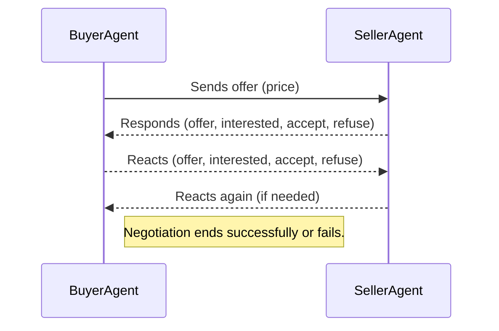

# Agent-Based Price Negotiation Protocol

<p align="center">

</p>

This README provides a detailed walkthrough of an **automated negotiation protocol** between two autonomous agents: **SellerAgent** and **BuyerAgent**. The protocol demonstrates **asynchronous communication**, **dynamic pricing strategies**, **randomized behaviors**, and **real-time tracking of negotiation outcomes**.


## Overview

In this system, two agents engage in a **continuous price negotiation**:
- The **buyer** tries to purchase at the **lowest possible price**, adjusting upward if needed.
- The **seller** tries to sell at the **highest possible price**, adjusting downward if needed.
- A negotiation **succeeds** when both agents agree on a price.
- Otherwise, the negotiation **fails** and a new session begins.

Each negotiation round uses **randomized initial prices** and **adjustments**, making the interactions **diverse** and **unpredictable** across time.


## Live Interaction Demo

The following animation shows a **real-time exchange** between the BuyerAgent and SellerAgent during negotiation:

<p align="center">

</p>

You can observe how each agent proposes, counters, and dynamically adjusts their offers before reaching an agreement, or terminating the negotiation.

The BuyerAgent and SellerAgent are designed to handle negotiations in noisy environments where many interactions occur concurrently. The following demo illustrates this by running two sellers and two buyers — resulting in eight simultaneous negotiations—on a single server instance.

<p align="center">

</p>


## Key Features

- **Dynamic and random price settings** for each negotiation round.
- **Asynchronous message exchange** using Python's `asyncio`.
- **Adaptive behavior** based on received offers.
- **Real-time success rate tracking** after every negotiation.
- **Continuous execution**: new negotiations start automatically.


## How the Negotiation Works

The agents communicate back and forth over a TCP connection. Each side follows a simple **protocol of messages**.

### BuyerAgent Behavior
- Starts with a **low initial offer** (random between 1 and their `MAX_ACCEPTABLE_PRICE`).
- **Increases** the offer gradually if necessary (by a random increment).
- Accepts an offer if the price is **affordable**.
- Refuses an offer if the seller's price remains **too high**.

### SellerAgent Behavior
- Starts with a **high initial offer** (random between `MIN_ACCEPTABLE_PRICE` and 100).
- **Decreases** the offer gradually (by a random decrement).
- Accepts an offer if the price is **high enough**.
- Refuses if the buyer's offer is **too low**.

### Message Types Exchanged

| Message Type | Meaning |
|--------------|---------|
| `offer`      | A proposed price (not yet a commitment). |
| `interested` | Willingness to accept if conditions improve slightly. |
| `accept`     | Acceptance of the current offer. |
| `refuse`     | Refusal of the current offer. |

Both agents react based on the message type and the price offered.


## Detailed Negotiation Flow



### Step-by-Step

1. **Buyer** starts by sending an initial offer.
2. **Seller** evaluates:
   - Accepts if acceptable.
   - Decreases price if necessary.
   - Otherwise, refuses.
3. **Buyer** evaluates the seller's response:
   - Increases offer if needed.
   - Shows interest if close to agreement.
   - Accepts or refuses depending on the situation.
4. **Success or failure** is recorded.
5. **New negotiation round** starts automatically.


## Code Structure

Both agents are structured around asynchronous loops and event-driven reactions:

### BuyerAgent

```plaintext
BuyerAgent
│
├── Randomly set MAX_ACCEPTABLE_PRICE and PRICE_INCREMENT
│
├── Negotiation loop:
│   ├── Start new negotiation
│   ├── Send initial offer
│   └── React to seller responses
│       ├── Increase offer if needed
│       ├── Express interest
│       ├── Accept or refuse
│
└── Track success/failure after each negotiation
```

### SellerAgent

```plaintext
SellerAgent
│
├── Randomly set MIN_ACCEPTABLE_PRICE and PRICE_DECREMENT
│
├── Negotiation loop:
│   ├── Start new negotiation
│   ├── Send initial offer
│   └── React to buyer offers
│       ├── Decrease price if needed
│       ├── Express interest
│       ├── Accept or refuse
│
└── Track success/failure after each negotiation
```

## Success Rate Tracking

Each agent keeps a **history list**:
- `1` = successful negotiation (deal made).
- `0` = unsuccessful negotiation (deal failed).

After each round, the agent prints:

```plaintext
[AgentName] Negotiation success rate: XX.XX% (Y successes / Z total)
```

The success rate is calculated as:

\[
\text{Success Rate} = \left( \frac{\text{Number of Successful Negotiations}}{\text{Total Negotiations}} \right) \times 100
\]


## How to Run

Open three terminals.

In the first terminal (SellerAgent):

```bash
python  examples/3_buyer_seller_agents/seller_agent.py
```

In the second terminal (BuyerAgent):

```bash
python examples/3_buyer_seller_agents/buyer_agent.py
```

In the third terminal (MyServer):

```bash
python examples/3_buyer_seller_agents/myserver.py --config server_config.json
```

The agents will connect locally (`127.0.0.1:8888`) and automatically start negotiating continuously.

---

## Notes

- Buyer sends a message approximately **every 2 seconds**.
- Seller sends a message approximately **every 3 seconds**.
- This slight mismatch leads to natural asynchronous behavior where agents might act before receiving a response.
- Each negotiation is independent thanks to randomized price settings at the start of each round.


## Conclusion

This example shows how to build simple, **adaptive**, **asynchronous**, and **self-evolving** agents that negotiate automatically. You can observe different outcomes depending on the random parameters, leading to either quick agreements or prolonged, unsuccessful negotiations.

The pattern here is fundamental to designing larger multi-agent negotiation or trading systems.
